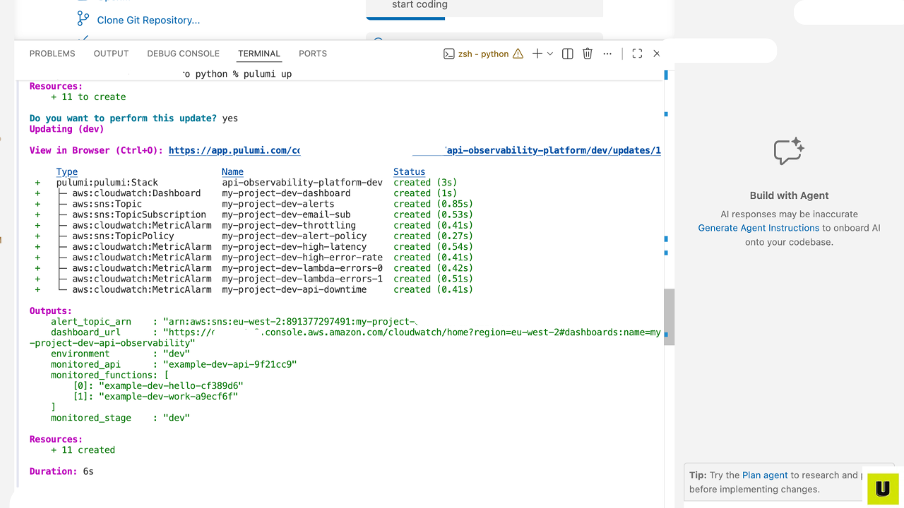
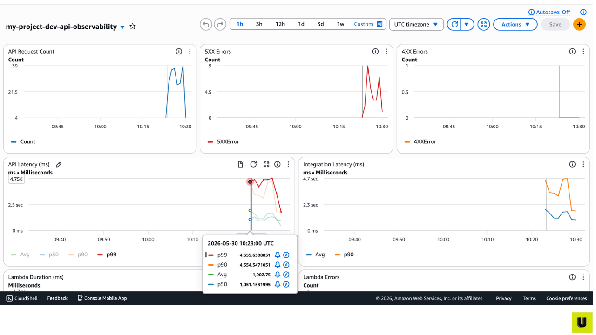
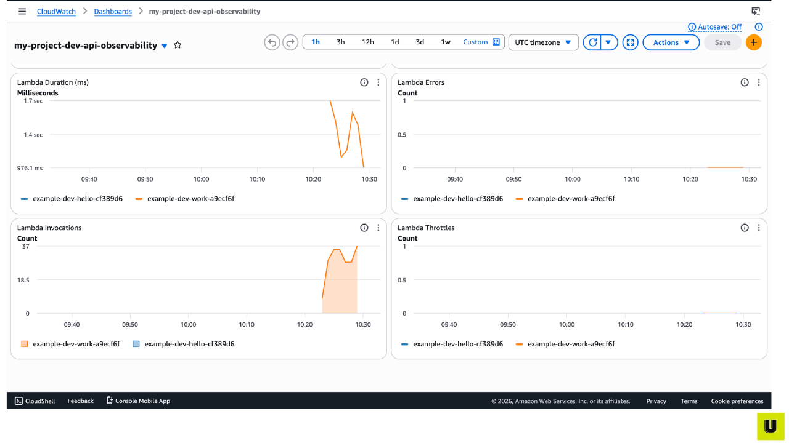
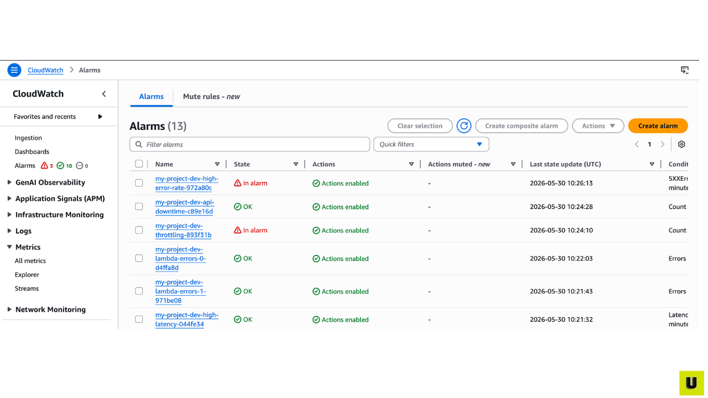
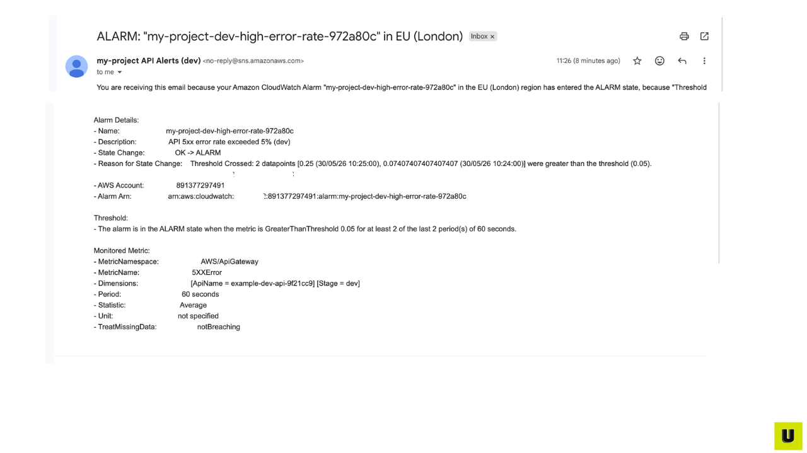
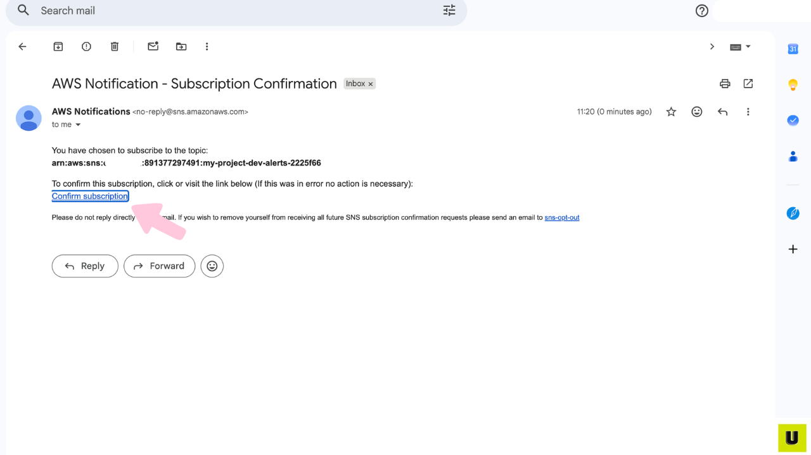

# API Gateway Observability Pulumi Templates

A reusable Pulumi template that provisions CloudWatch dashboards, automated alarms, and SNS email alerts for any AWS API Gateway in under 30 seconds.

Available in **Python**, **Node.js / TypeScript**, and **Go**.

## The Problem This Solves

Every team running APIs on AWS faces the same situation: something goes wrong in production, and nobody notices until customers start complaining. Latency spikes, error rates climb, Lambda functions throw exceptions and the team only finds out hours later because there's no monitoring in place.

The usual fix is to spend a sprint clicking through CloudWatch creating dashboards by hand, configuring alarms one at a time, copying JSON between widgets, setting up SNS topics, and confirming email subscriptions. It works, but it's tedious, error-prone, and impossible to replicate consistently across environments or teams.

## The Solution

Point this template at any existing API Gateway, run `pulumi up`, and you get a complete monitoring setup in under 30 seconds. CloudWatch dashboard, five alarms, SNS topic, email subscription all provisioned, all wired together, all version-controlled.

### Real-world examples

**A fintech startup** runs an API serving thousands of payment requests an hour. The CTO needs to know within minutes if latency spikes or errors climb above 5% but the team can't justify spending a week building monitoring infrastructure from scratch. With this template, they deploy production-grade observability across dev, staging, and prod in 90 seconds total, with stricter thresholds in production set via config flags.

**An NHS trust** operates an internal API for patient record lookups. Compliance requires uptime monitoring and audit trails for every alert. Building this manually would take their small platform team weeks. With this template deployed, every alarm state change is logged automatically, emails go to the on-call team, and the entire monitoring configuration lives in Git for auditors to review.

The same pattern fits any team running AWS API Gateway in production SaaS companies, government services, internal platforms, e-commerce backends.

## What It Does

When you run `pulumi up`, this template provisions:

- **CloudWatch Dashboard** — request count, latency percentiles (p50/p90/p99), 4XX/5XX errors, Lambda performance
- **5 CloudWatch Alarms** — high latency, high error rate, API downtime, Lambda errors, throttling
- **SNS Email Alerts** — instant notifications when something breaks

No console clicking. No manual JSON. Just config and deploy.

## Proof It Works

Every screenshot below is from a real deployment.

### Deployment

One command provisions 11 monitoring resources in 6 seconds:



### CloudWatch dashboard

After traffic flows through the monitored API, the dashboard populates automatically with request counts, latency percentiles, and error rates:



Lambda metrics appear in the same dashboard duration, errors, invocations, throttles:



### Alarms fire automatically when thresholds are breached

When error rate or latency exceeds the configured thresholds, alarms transition from OK to In Alarm:



### Alarm notifications arrive by email

Every alarm state change sends a detailed email with the threshold breached, the state transition, and the monitored metric:



The SNS subscription is set up automatically confirm once and notifications start flowing:



## Choose Your Language

| Language | Status | Folder |
|----------|--------|--------|
| Python | ✅ Available | [`python/`](./python/) |
| Node.js / TypeScript | ✅ Available | [`nodejs/`](./nodejs/) |
| Go | ✅ Available | [`golang/`](./golang/) |

Each language folder is self-contained with its own README and deployment instructions.

## Why Multiple Languages?

Pulumi lets you write infrastructure in real programming languages, not config files. Teams already have a preferred language for their codebase, and forcing them to learn a new one just for infrastructure is friction. This template provides identical functionality across Python, Node.js, and Go so any team can adopt it.

## Quick Start (Python)

```bash
cd python/
python3 -m venv venv
source venv/bin/activate
pip install -r requirements.txt
pulumi stack init dev
pulumi config set alert_email your@email.com
pulumi config set api_gateway_name your-api-name
pulumi up
```

See the [Python README](./python/README.md) for full instructions.

## Don't Have an API to Monitor?

Each language version includes an example API in its `examples/` folder. Deploy that first, then point the monitoring template at it.

## Project Structure

\`\`\`
api-gateway-observability-pulumi/
├── python/              # Python implementation
├── nodejs/              # Node.js / TypeScript implementation
├── golang/              # Go implementation
├── docs/                # Shared documentation and screenshots
├── README.md            # This file
└── LICENSE
\`\`\`

## Contributing

Found a bug or want to add a feature? Open an issue or pull request. If you're porting the template to another language not listed here, that contribution is especially welcome.

## License

MIT
